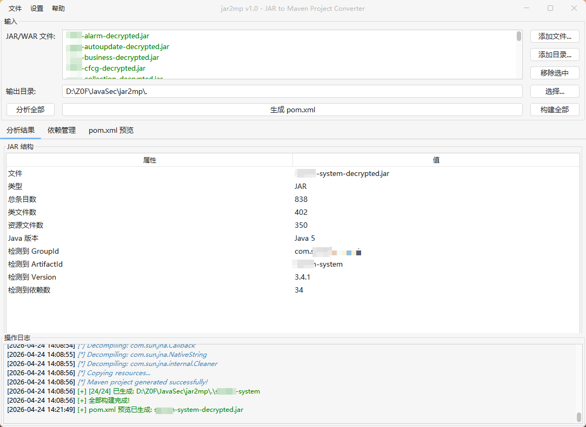
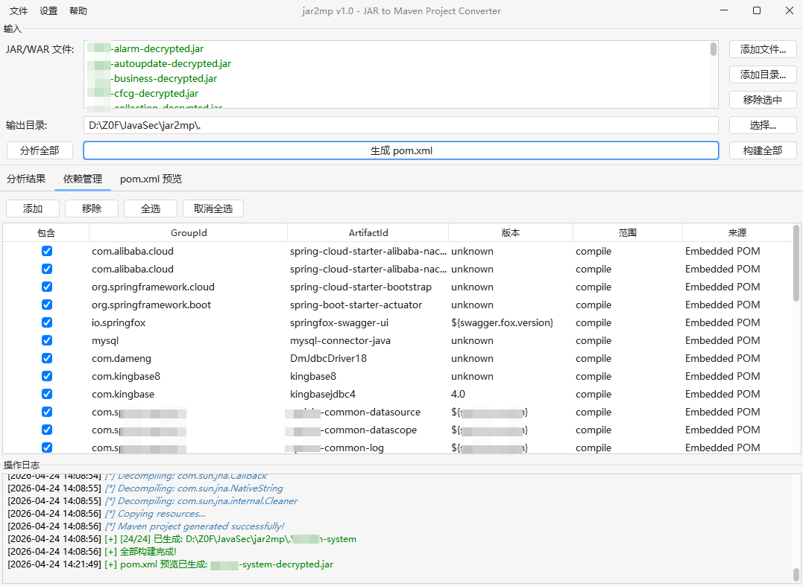
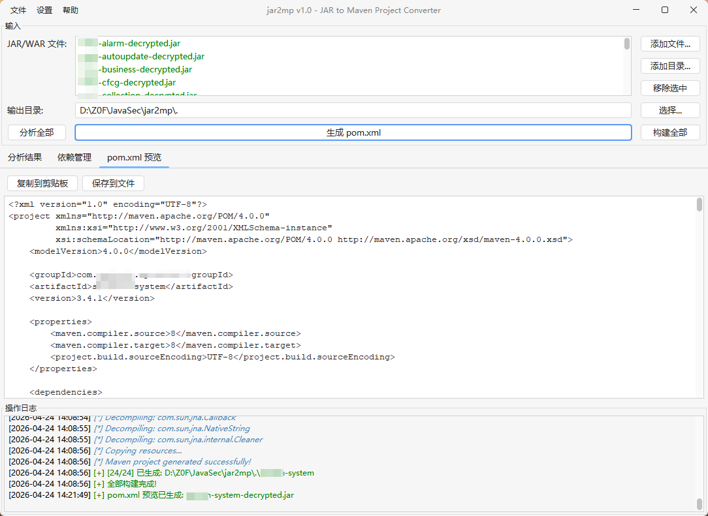
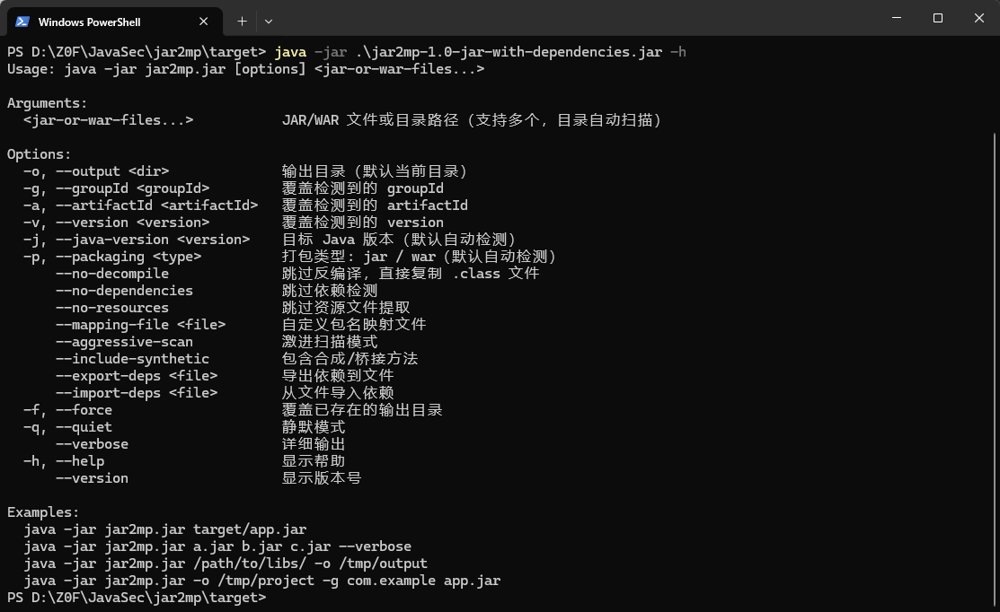

# jar2mp

JAR to Maven Project Converter - 将 JAR/WAR 文件自动还原为标准 Maven 项目，支持批量处理。

## 功能特性

- **批量处理**: 同时选择多个 JAR/WAR 文件或整个目录进行批量分析和构建
- **双模式运行**: 支持 GUI 图形界面 和 CLI 命令行两种使用方式
- **自动依赖检测**: 4 层检测策略（嵌入 POM > MANIFEST.MF > 字节码扫描 > 文件名启发式）
- **自动反编译**: 集成 CFR、JD-Core、JADX、Fernflower 多引擎仲裁，将 .class 文件还原为 .java 源码
- **智能坐标识别**: 自动提取 groupId / artifactId / version
- **80+ 常见库映射**: 内置 Google、Apache Commons、Spring、Jackson、Alibaba 等常见库的包名→Maven 坐标映射
- **WAR 文件支持**: 自动识别 WAR 包并处理 WEB-INF 结构
- **可编辑依赖**: GUI 中可手动增删、编辑、勾选检测到的依赖
- **pom.xml 预览**: 生成前可预览和编辑 pom.xml，切换文件时自动缓存编辑内容
- **还原报告**: 输出资源清单、启动手册、字节码 parity 报告和验证结果
- **主题切换**: GUI 支持 FlatLaf 多主题（Light / Dark / Darcula / IntelliJ / Mac）

## 编译构建

```bash
mvn clean package
```

构建产物位于 `target/jar2mp-1.0-jar-with-dependencies.jar`。

## 使用方式

### GUI 模式

直接双击 JAR 包或无参数启动：

```bash
java -jar jar2mp-1.0-jar-with-dependencies.jar
```

操作流程：
1. 点击 **添加文件** 选择一个或多个 JAR/WAR 文件，或点击 **添加目录** 自动扫描目录中的 jar/war 文件
2. 设置输出目录
3. 点击 **分析全部** 批量分析所有文件的 JAR 结构和依赖
4. 在文件列表中点击切换不同文件，查看各自的分析结果和依赖
5. 在 **依赖管理** 标签页中编辑选中文件的依赖
6. 点击 **生成 pom.xml** 预览当前选中文件的 pom.xml
7. 点击 **构建全部** 批量生成所有文件的 Maven 项目







### CLI 模式

带参数启动即进入 CLI 模式，支持多文件和目录输入：

```bash
java -jar jar2mp-1.0-jar-with-dependencies.jar [options] <jar-or-war-files...>
```

#### 常用示例

```bash
# 单个文件
java -jar jar2mp.jar target/app.jar

# 批量处理多个文件
java -jar jar2mp.jar a.jar b.jar c.jar --verbose

# 自动扫描目录中所有 jar/war 文件
java -jar jar2mp.jar /path/to/libs/ -o /tmp/output

# 指定输出目录和坐标
java -jar jar2mp.jar -o /tmp/project -g com.example -a myapp target/app.jar

# 详细输出模式
java -jar jar2mp.jar --verbose lib.jar

# 跳过反编译（仅复制 .class 文件）
java -jar jar2mp.jar --no-decompile lib.jar

# 导出检测到的依赖到文件
java -jar jar2mp.jar --export-deps deps.txt app.jar

# 覆盖已存在的输出目录
java -jar jar2mp.jar -f app.jar
```

<!-- CLI 运行截图 -->


#### 完整参数列表

```
Usage: java -jar jar2mp.jar [options] <jar-or-war-files...>

Arguments:
  <jar-or-war-files...>           JAR/WAR 文件或目录路径（支持多个，目录自动扫描）

Options:
  -o, --output <dir>              输出目录（默认当前目录）
  -g, --groupId <groupId>         覆盖检测到的 groupId
  -a, --artifactId <artifactId>   覆盖检测到的 artifactId
  -v, --version <version>         覆盖检测到的 version
  -j, --java-version <version>    目标 Java 版本（默认自动检测）
  -p, --packaging <type>          打包类型: jar / war（默认自动检测）
      --no-decompile              跳过反编译，直接复制 .class 文件
      --no-dependencies           跳过依赖检测
      --no-resources              跳过资源文件提取
      --mapping-file <file>       自定义包名映射文件
      --aggressive-scan           激进扫描模式
      --include-synthetic         包含合成/桥接方法
      --export-deps <file>        导出依赖到文件
      --import-deps <file>        从文件导入依赖
      --verify-build              构建后运行 Maven 验证
      --verify-goal <goal>        验证使用的 Maven goal（默认 compile）
      --trace-runtime             启用运行时追踪报告
      --trace-args <args>         指定运行时追踪参数
      --trace-timeout <seconds>   设置运行时追踪超时（默认 120 秒）
      --smoke-only                启用运行时追踪并跳过 Maven 验证
      --emit-raw-artifact         在 target/raw-artifact/ 生成原始归档的字节保真副本
      --byte-exact-package        让生成项目 mvn package 输出原始归档的字节级保真 artifact
      --compare-artifact <file>   将输入原始归档与指定重建归档做字节保真度对比
  -f, --force                     覆盖已存在的输出目录
  -q, --quiet                     静默模式
      --verbose                   详细输出
  -h, --help                      显示帮助
      --version                   显示版本号
```

## 依赖检测策略

工具按以下优先级依次检测 Maven 依赖：

| 优先级 | 策略 | 说明 | 置信度 |
|--------|------|------|--------|
| 1 | 嵌入 POM | 读取 `META-INF/maven/**/pom.properties` 和 `pom.xml` | HIGH |
| 2 | MANIFEST.MF | 解析 `Class-Path`、`Implementation-*` 等属性 | MEDIUM |
| 3 | 字节码扫描 | 解析 .class 常量池中的包引用，匹配映射数据库 | LOW |
| 4 | 文件名启发式 | 从 JAR 文件名猜测 `artifactId-version` | GUESS |

## 还原与报告

每个项目会生成以下报告：

- `restoration-report.md` - 还原结果总览
- `resource-inventory.md` - 资源分类与目标路径
- `decompile-parity-report.md` - 字节码与源码对照
- `restoration-score.md` - 综合还原评分
- `gap-summary.md` - 主要缺口汇总
- `runtime-trace-report.md` - 运行时追踪报告（启用运行时追踪时生成）
- `RUNBOOK.md` - 启动候选与运行方式
- `verification-report.md` - 启用 `--verify-build` 时的 Maven 验证摘要
- `verification-errors.md` - 启用 `--verify-build` 时解析出的逐文件编译错误明细
- `decompile-failures.md` - 反编译失败条目和原始 class 退回位置
- `artifact-fidelity-report.md` / `artifact-fidelity-summary.csv` - 启用 `--compare-artifact` 时的原始/重建 artifact 对比；如果内容一致但 ZIP entry 顺序或可原位恢复的 ZIP 元数据不同，还会生成 `archive-order-restored/` 候选和对应保真报告
- `target/byte-exact-package-check/artifact-fidelity-report.md` - 启用 `--byte-exact-package --verify-build` 且 package 生命周期运行时的最终产物保真报告

当输入归档包含仅大小写不同的 class 路径时，jar2mp 不会把这些 class 展开到普通目录；它会生成 `target/compiler-fallback-classes.jar` 并在 `pom.xml` 中加入 system-scope 依赖，避免大小写不敏感文件系统破坏 Maven 编译类路径。

推荐验证流程：

1. 先看 `restoration-report.md` 和 `resource-inventory.md`
2. 再看 `RUNBOOK.md` 确认启动方式
3. 用 `decompile-parity-report.md` 检查反编译风险
4. 看 `restoration-score.md` 和 `gap-summary.md` 了解整体还原度
5. 如需确认可编译性，启用 `--verify-build`

## 样本回归验证

仓库提供本地样本回归脚本，用于生成普通 Maven JAR、Spring Boot JAR、WAR、MyBatis、Shiro、Spring Security、ProGuard 混淆 JAR、无 debug 信息 JAR，并逐类运行还原评分：

```bash
./scripts/regression/run-sample-regression.sh
```

汇总报告写入 `target/regression-samples/report/regression-summary.md` 和 `target/regression-samples/report/regression-summary.csv`。样本矩阵、阈值和 PASS/FAIL 规则见 `docs/regression-samples.md`。

也可以运行真实 GitHub 项目回归集，脚本会下载固定 ref 的 Spring Boot、Spring Security、MyBatis WAR、Shiro 样本，构建原始产物后再用 jar2mp 做 verify-only 还原验证：

```bash
./scripts/regression/run-github-realworld-regression.sh
```

汇总报告写入 `target/realworld-samples/report/github-realworld-summary.md` 和 `target/realworld-samples/report/github-realworld-summary.csv`。realworld 矩阵会分别记录 source rebuild artifact fidelity、raw artifact exact 和 byte-exact package 门禁；样本来源、固定 ref、阈值和已知非门禁候选见 `docs/github-realworld-regression.md`。

也可以运行下载型 GitHub Release 二进制样本矩阵，脚本会下载固定 release asset 并验证还原项目的编译门禁与 raw artifact 保真：

```bash
./scripts/regression/run-github-release-assets-regression.sh
```

汇总报告写入 `target/release-assets-samples/report/github-release-assets-summary.md` 和 `target/release-assets-samples/report/github-release-assets-summary.csv`。`PASS_WITH_WARNINGS` 表示 Maven package 验证、raw artifact exact 与 byte-exact package 门禁通过，但仍存在 raw-class fallback、运行时跳过/告警或源码分数未满分。

严格字节级还原使用 `--byte-exact-package`：它会隐式启用 `--emit-raw-artifact`，在生成的 `pom.xml` 中使用原始归档文件名作为 `finalName`、加入 package 阶段覆盖步骤、写入常见测试/质量插件的 skip properties，并省略会改写 package 产物的 shade/assembly/repackage 插件，使恢复项目执行 `mvn package` 后的最终 JAR/WAR 与原始归档字节级一致。和 `--verify-build` 一起使用时，默认验证目标会从 `compile` 提升为 `package`，并在 `target/byte-exact-package-check/` 写入最终 package 产物的字节保真报告；显式 `--verify-goal` 仍可覆盖。普通 `--emit-raw-artifact` 只保留原始副本，不改变 `mvn package` 的源码重构产物；普通源码重构包会在 `process-classes` 阶段回填原始 class bytes，用于隔离剩余 ZIP 容器层差异。

对于已经下载到 `target/adhoc-github-release-assets/assets/` 的临时 GitHub Release 二进制样本，可以运行离线缓存矩阵来刷新当前源码的编译、raw artifact 与 byte-exact package 门禁结果：

```bash
./scripts/regression/run-cached-adhoc-release-assets-regression.sh
```

汇总报告写入 `target/adhoc-github-release-assets/report-current/adhoc-github-release-assets-summary.md` 和 `target/adhoc-github-release-assets/report-current/adhoc-github-release-assets-summary.csv`。固定缓存样本、PASS 规则和输出目录见 `docs/regression-samples.md`。

能还原的主要内容：

- Java 源码、资源文件、WEB-INF 结构、常见配置、Maven 坐标、原始 class bytes、原始 `META-INF/maven/**` metadata、原始 manifest、build-info/SBOM 等可保留构建元数据

不能保证完全还原的内容：

- 反射调用的真实运行时行为
- 混淆/损坏的 class
- 缺失调试信息导致的局部变量名恢复
- 运行时生成内容、外部服务依赖和部署环境

## 生成项目结构

每个输入文件在输出目录下生成独立的项目：

```
{output}/
├── {artifactId-1}/
│   ├── pom.xml
│   ├── restoration-report.md
│   ├── resource-inventory.md
│   ├── decompile-parity-report.md
│   ├── restoration-score.md
│   ├── gap-summary.md
│   ├── runtime-trace-report.md   ← 启用运行时追踪时生成
│   ├── RUNBOOK.md
│   ├── verification-report.md
│   ├── verification-errors.md
│   ├── decompile-failures.md
│   ├── target/
│   │   ├── original-classes/   ← 反编译失败时保留的原始 class
│   │   ├── byte-exact-package-check/  ← byte-exact package 保真报告
│   │   └── compiler-fallback-classes.jar  ← 大小写冲突 class 的编译 fallback jar
│   └── src/
│       ├── main/
│       │   ├── java/          ← 反编译后的 .java 文件（保留包结构）
│       │   ├── resources/     ← 非类文件资源 + META-INF/services
│       │   ├── original-classes/ ← clean package 时回填原始 class bytes 和 entry mtime
│       │   ├── original-libs/  ← 普通 WAR clean package 时回填原始 WEB-INF/lib
│       │   └── webapp/        ← WAR 根资源与 WEB-INF 相关资源
│       └── test/
│           ├── java/
│           └── resources/
├── {artifactId-2}/
│   ├── pom.xml
│   └── src/
│       └── ...
└── ...
```

## 项目技术栈

- **Java 8** - 目标兼容版本
- **FlatLaf** - GUI 主题框架
- **CFR / JD-Core / JADX / Fernflower** - 交叉反编译与质量仲裁
- **Gson** - JSON 处理
- **Maven Assembly Plugin** - 打包为可执行 fat JAR

## License

MIT
